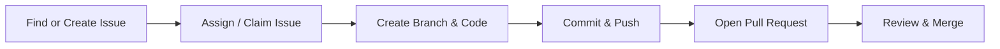

# How to Contribute

Welcome to our project! Whether you are fixing a typo, adding a new feature, or proposing an idea, all contributions are welcome. No prior open-source experience is required.

---

## Quick Preparation

Before writing code, make sure your development environment is set up:
- **[Editor Setup Guide](./Editor-Setup.md)**: Recommended setups for VS Code and JetBrains WebStorm.
- **[Git Setup and Workflow Guide](./Git-Setup-and-Workflow.md)**: Installing Git, cloning, branching, and managing commits.

---

## Contribution Workflow

### 1. Find or Create an Issue

Every contribution starts with a GitHub Issue:

- **We encourage opening issues!** If you discover a bug, have an idea for a new feature, or see something confusing in the documentation, please [open an issue](https://github.com/UTDNebula/engineeringSandbox/issues/new/choose).
- **Looking for something to work on?** Check existing issues. Look for beginner-friendly labels like:
  - `good first issue`: Ideal for newcomers.
  - `help wanted`: Tasks that need extra hands.
  - `bug` or `enhancement`: Reported problems and feature requests.

### 2. Claim the Issue
To avoid duplicate work:
- Assign the issue to yourself if you have permission, or leave a quick comment: *"I'd like to work on this!"*
- A maintainer will confirm and assign it to you.

### 3. Build & Test Your Changes
1. Create a new branch from `main` (see [Git Workflow](./Git-Setup-and-Workflow.md#step-2-create-a-feature-branch)).
2. Make your changes and test locally.
3. Commit with [clear commit messages](./Git-Setup-and-Workflow.md#step-3-stage-and-commit-changes).

### 4. Open a Pull Request (PR)
1. Push your branch to GitHub and click **"Compare & pull request"**.
2. **Link the issue**: In your PR description, write `Fixes #<issue-number>` or `Closes #<issue-number>` so the issue closes automatically when merged.
3. Fill out the PR template checklist and describe your changes.
4. Learn more from [GitHub's Pull Request Guide](https://docs.github.com/en/pull-requests/collaborating-with-pull-requests/proposing-changes-to-your-work-with-pull-requests/about-pull-requests).

### 5. Code Review
- Maintainers or teammates will review your PR and may suggest tweaks.
- Push any additional changes to the same branch—your PR will update automatically.
- Once approved and CI checks pass, your PR will be merged!

---

## Troubleshooting & Getting Help

Getting stuck is a normal part of development! If you run into merge conflicts, test failures, or environment setup issues:

1. Check our [Handling Merge Conflicts](./Git-Setup-and-Workflow.md#5-handling-merge-conflicts--syncing) section.
2. Search [GitHub Docs](https://docs.github.com/).
3. **Ask on Discord**: Head over to the **[Nebula Discord Server](https://discord.utdnebula.com/)** and post your question in the project or engineering channels. Our community and maintainers are here to help.